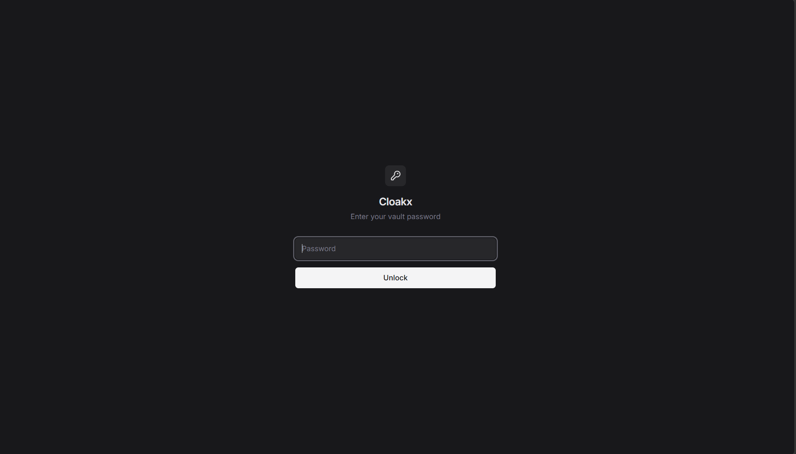
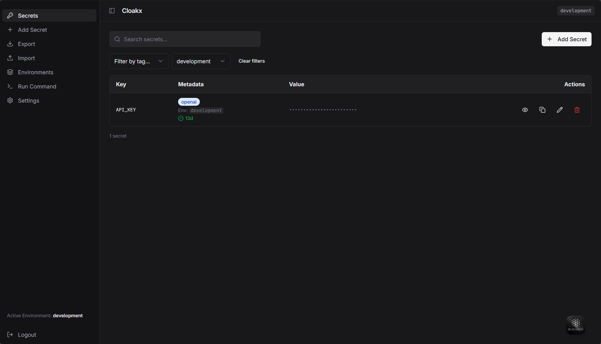
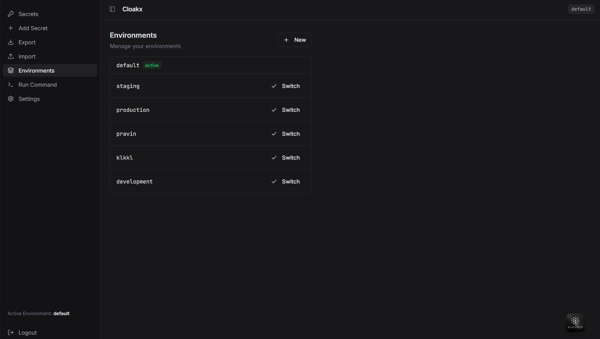
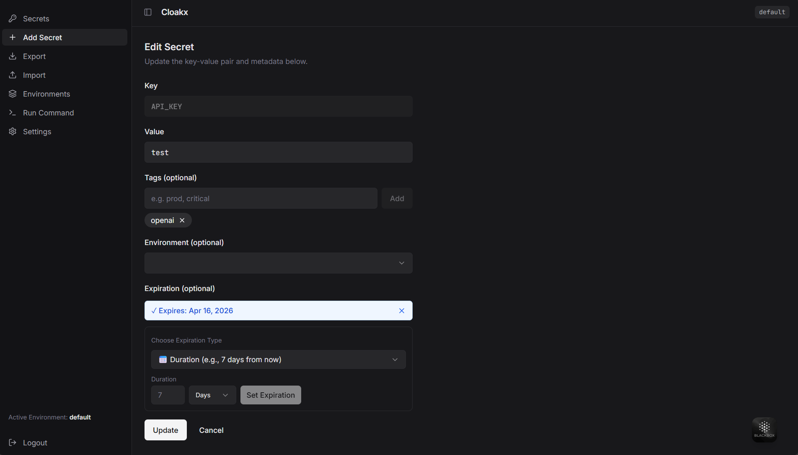
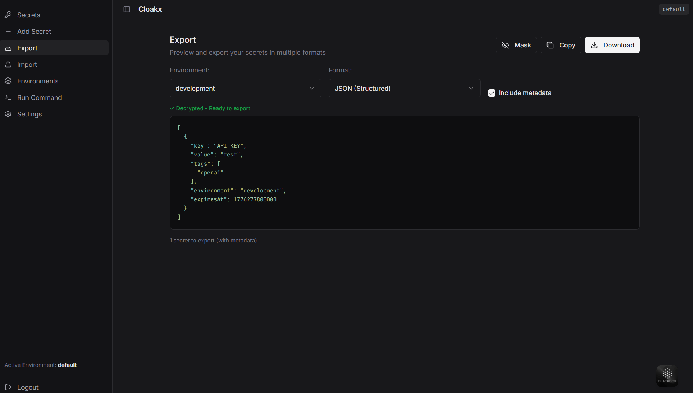
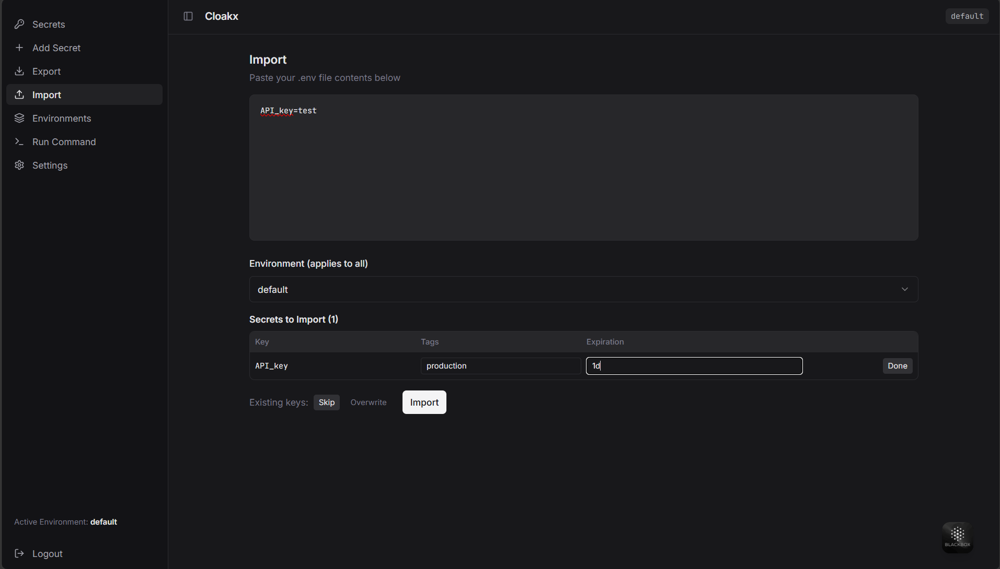

# 🕶️ Cloakx - Secure Secret Manager

**Cloakx** is a powerful, developer-friendly secret management tool that combines a secure CLI and beautiful web UI. Manage encrypted secrets locally with ease — perfect for developers, DevOps, and teams.

> 🔐 **Secure. Simple. Scalable.** Store API keys, tokens, database credentials, and sensitive data with military-grade encryption (AES-256-GCM) and password protection.

---

## ✨ Key Features

### 🔐 **Security**
- AES-256-GCM encryption for all secrets
- PBKDF2 password hashing
- Password-protected vault access
- Local-first architecture (no cloud required)
- Session management with auto-logout

### 💾 **Secret Management**
- Add, retrieve, update, and delete secrets in seconds
- Multiple environment support (default, production, staging, custom)
- Metadata tagging for organizing secrets
- Expiration tracking for time-sensitive secrets
- Bulk import/export with .env format support

### 🌐 **User Interfaces**
- **CLI**: Full-featured command-line interface with 17+ commands
- **Web UI**: Modern, responsive dashboard for browser-based access
- **Environment Switching**: Easily manage secrets across environments
- **Real-time Sync**: Keep secrets synchronized

### 🚀 **Developer Features**
- Command injection with `run` command (auto-inject as env vars)
- One-time encryption/decryption utilities
- JSON and YAML export/import
- Git-friendly (add ~/.cloakx to .gitignore)
- Cross-platform support (Windows, macOS, Linux)

---

## 📦 Installation

### Option 1: Global NPM Installation
```bash
npm install -g cloakx
# or with yarn
yarn global add cloakx
# or with pnpm
pnpm add -g cloakx
```

### Option 2: Local Project Installation
```bash
npm install cloakx
npx cloakx --help
```

### Option 3: Development Installation (from source)
```bash
git clone https://github.com/yourusername/cloak.git
cd cloak
npm install
npm run build
node dist/src/index.js --help
```

---

## 🚀 Quick Start (2 minutes)

### 1. **Initialize & Login**
```bash
cloakx login
# Creates a new vault with your password
```

### 2. **Add Your First Secret**
```bash
cloakx set API_KEY "sk_live_abc123xyz"
cloakx set DATABASE_URL "postgres://localhost:5432/mydb"
```

### 3. **Retrieve Secrets**
```bash
cloakx get API_KEY
# Output: sk_live_abc123xyz

cloakx get DATABASE_URL
# Output: postgres://localhost:5432/mydb
```

### 4. **List All Secrets**
```bash
cloakx list
# Shows all stored keys
```

### 5. **Start Web UI**
```bash
cloakx web
# Opens http://localhost:3001
```

---

## 📖 Complete CLI Command Reference

### 🔐 **Authentication Commands**

#### **login** - Initialize or authenticate vault
```bash
cloakx login
# Interactive: Enter your vault password
# Creates ~/.cloakx/ directory with encrypted vault
```

#### **logout** - Clear current session
```bash
cloakx logout
# Session is cleared, requires login for next operations
```

#### **status** - Check authentication status
```bash
cloakx status
# Shows login status and active environment
```

#### **change-password** - Update vault password
```bash
cloakx change-password
# Interactive: Old password → New password → Confirm
# Re-encrypts entire vault with new password
```

---

### 💾 **Secret Management Commands**

#### **set | add** - Add or update a secret
```bash
# Basic usage
cloakx set DATABASE_URL "postgres://localhost:5432/mydb"
cloakx add API_KEY "sk_live_123abc"

# With specific environment
cloakx set DATABASE_URL "postgres://prod.com/db" --env production

# With tags (for organization)
cloakx set STRIPE_KEY "rk_test_123" --tags "payment,stripe,critical"

# With expiration
cloakx set TEMP_TOKEN "token_xyz" --expires "7d"
cloakx set API_KEY "key_abc" --expires "2026-12-31"
```

#### **get** - Retrieve a secret
```bash
# Get from current environment
cloakx get DATABASE_URL

# Get from specific environment
cloakx get DATABASE_URL --env production

# Examples
cloakx get API_KEY
cloakx get STRIPE_KEY --env production
```

#### **list** - Show all secrets
```bash
# List in current environment
cloakx list

# List in specific environment
cloakx list --env production
cloakx list --env staging

# Filter by tag
cloakx list --tag critical
cloakx list --tag payment

# Show expired secrets
cloakx list --expired
```

#### **update | upd** - Modify a secret
```bash
# Update value
cloakx update DATABASE_URL "postgres://newhost:5432/db"
cloakx upd API_KEY "new_key_value_456"

# Update with new expiration
cloakx update TEMP_TOKEN "new_token" --expires "30d"

# Update in specific environment
cloakx update DATABASE_URL "postgres://prod-db.com/db" --env production
```

#### **del** - Delete a secret
```bash
# Delete from current environment
cloakx del API_KEY
cloakx del DATABASE_URL

# Delete from specific environment
cloakx del DATABASE_URL --env staging
```

---

### 🔧 **Utility Commands**

#### **encrypt** - One-time encryption (no vault storage)
```bash
cloakx encrypt "sensitive data here"
# Output: Encrypted base64 string
# Use for: Sharing encrypted values via email/chat
```

#### **decrypt** - One-time decryption
```bash
cloakx decrypt "encrypted_base64_string_here"
# Output: Decrypted plaintext
# Use for: Decrypting shared encrypted values
```

#### **export** - Export secrets as files
```bash
# Export to stdout (.env format)
cloakx export

# Export to file
cloakx export --file backup.env
cloakx export --file prod-secrets.env --env production

# Export specific secret
cloakx export DATABASE_URL

# Export with masked values
cloakx export --masked

# Copy to clipboard
cloakx export --copy

# Examples
cloakx export --file .env.production --env production
cloakx export --file .env.staging --env staging
```

#### **import** - Import secrets from files
```bash
# Create a test file first
cat > secrets.env << EOF
DB_HOST=localhost
DB_USER=admin
DB_PASSWORD=secret123
EOF

# Import
cloakx import secrets.env

# Import to specific environment
cloakx import secrets.env --env production
cloakx import backup.env --env staging

# Import without prompting
cloakx import secrets.env --use-existing

# Supported formats
cloakx import config.json      # JSON
cloakx import secrets.env      # .env format
cloakx import config.yaml      # YAML
```

---

### 🌍 **Environment Management**

#### **env** - Manage multiple environments
```bash
# List all environments
cloakx env list
# Output: default, production, staging, development

# Show current active environment
cloakx env current
# Output: production

# Create new environment
cloakx env create production
cloakx env create staging
cloakx env create development
cloakx env create test

# Switch to environment
cloakx env set default
cloakx env set production
cloakx env set staging

# Delete environment
cloakx env delete test

# Workflow example
cloakx env create production
cloakx env set production
cloakx set DATABASE_URL "postgres://prod.example.com/db"
cloakx set API_KEY "prod_key_xyz"

cloakx env set default
cloakx set DATABASE_URL "postgres://localhost/dev_db"
```

---

### 🚀 **Advanced Commands**

#### **run** - Execute command with injected secrets
```bash
# Create a test app
cat > app.js << EOF
console.log('DB:', process.env.DATABASE_URL);
console.log('API:', process.env.API_KEY);
EOF

# Run with all secrets injected as env vars
cloakx run node app.js

# Run from specific environment
cloakx run --env production node app.js
cloakx run --env staging npm start

# Run any command
cloakx run python app.py
cloakx run bash script.sh
cloakx run docker run myimage
cloakx run npm start

# Security: Secrets aren't visible in process list or shell history
```

#### **web** - Launch Web UI
```bash
cloakx web
# Starts:
#   Frontend: http://localhost:3001
#   Backend API: http://localhost:8080
# 
# Open browser to http://localhost:3001
# Login with vault password
```

#### **sync** - Synchronize vault
```bash
cloakx sync
# Syncs vault data (useful if configured with backend)
```

---

## 🌐 Web UI Documentation

### **Accessing the Web Interface**
```bash
cloakx web
# Navigate to http://localhost:3001
```

### **UI Features**

#### **1. Login Page**
- **Purpose**: Authenticate with your vault password
- **Use Case**: Secure access to all secrets from browser
- **Features**:
  - Password field with visibility toggle
  - Secure authentication
  - Session management



---

#### **2. Dashboard - Secrets View**
- **Purpose**: Display all secrets in current environment
- **Use Case**: View, create, edit, and delete secrets
- **Features**:
  - List all secrets with keys
  - Search/filter secrets
  - Add new secret button
  - Edit secret in-place
  - Delete secret with confirmation
  - Tags display
  - Expiration status

**Sample Workflow:**
```
1. View Dashboard
2. See: DATABASE_URL, API_KEY, STRIPE_KEY
3. Click "Add Secret"
4. Enter key: NEW_API_TOKEN
5. Enter value: token_xyz
6. Click Save
7. Secret appears in list
```



---

#### **3. Environment Switcher**
- **Purpose**: Switch between environments
- **Use Case**: Manage secrets for different environments
- **Features**:
  - Dropdown with all environments
  - Current environment indicator
  - Create new environment
  - Delete environment

**Sample Workflow:**
```
1. Click Environment dropdown
2. Select "production"
3. Dashboard updates with production secrets
4. Add/edit/delete secrets specific to production
5. Switch to "staging" via dropdown
6. See different secrets for staging
```



---

#### **4. Secret Editor**
- **Purpose**: Add or edit individual secrets
- **Use Case**: Detailed secret management
- **Features**:
  - Key/Value input
  - Tags input
  - Expiration date picker
  - Duration selector (1d, 7d, 30d, custom)
  - Metadata display
  - Save/Cancel buttons

**Sample Workflow:**
```
1. Click on existing secret or "Add Secret"
2. Enter Key: API_KEY
3. Enter Value: sk_live_abc123
4. Add Tags: #payment #external
5. Set Expiration: 30 days
6. Click Save
7. Secret updated with metadata
```



---

#### **5. Import/Export Modal**
- **Purpose**: Bulk import/export secrets
- **Use Case**: Backup, migrate, or share environments
- **Features**:
  - Import from .env file
  - Export current environment
  - Download as file
  - Copy to clipboard
  - Format selection

**Sample Workflow:**
```
1. Click "Export" button
2. Choose format: .env
3. Download secrets.env
4. Use for: Docker, CI/CD deployment
5. Or click "Import"
6. Select file: backup.env
7. Secrets imported to current environment
```





---

#### **6. Settings Page**
- **Purpose**: Change password and manage session
- **Use Case**: Security management
- **Features**:
  - Change password
  - View current session
  - Logout

**Sample Workflow:**
```
1. Click Settings/Profile
2. Click "Change Password"
3. Enter old password
4. Enter new password
5. Confirm new password
6. Click Update
7. Password changed, vault re-encrypted
```

---

## 💡 Use Case Examples

### **Use Case 1: Development Environment**
```bash
# Setup
cloakx env create development
cloakx env set development

# Add local dev secrets
cloakx set DATABASE_URL "postgres://localhost:5432/mydb"
cloakx set API_KEY "dev_key_abc123"
cloakx set STRIPE_KEY "sk_test_123"

# Run your app with secrets
cloakx run npm start

# Web UI access
cloakx web
# Manage secrets in http://localhost:3001
```

---

### **Use Case 2: Production Deployment**
```bash
# Setup production environment
cloakx env create production
cloakx env set production

# Import production secrets from file
cloakx import prod-secrets.env

# Export for Docker deployment
cloakx export --file .env.prod

# Dockerfile can use:
# COPY .env.prod .env
# Or inject via: cloakx run docker run myapp
```

---

### **Use Case 3: Secure Secret Sharing**
```bash
# Encrypt and share API key
cloakx encrypt "sk_live_secret_key_here"
# Output: encrypted_base64_string

# Share via email/Slack: encrypted_base64_string

# Recipient decrypts
cloakx decrypt "encrypted_base64_string"
# Output: sk_live_secret_key_here
```

---

### **Use Case 4: Multiple Environments**
```bash
# Create environments for full workflow
cloakx env create development
cloakx env create staging
cloakx env create production

# Development
cloakx env set development
cloakx set DATABASE_URL "localhost"
cloakx set DEBUG "true"

# Staging
cloakx env set staging
cloakx set DATABASE_URL "staging-db.com"
cloakx set DEBUG "false"

# Production
cloakx env set production
cloakx set DATABASE_URL "prod-db.com"
cloakx set DEBUG "false"

# Deploy with correct environment
cloakx env set production
cloakx run npm start
```

---

### **Use Case 5: CI/CD Pipeline**
```bash
# In CI/CD configuration:

# 1. Install cloakx
npm install -g cloakx

# 2. Initialize vault (from backup)
cloakx import ci-secrets.env

# 3. Export for Docker
cloakx export --file .env

# 4. Build and run
cloakx run docker build -t myapp .
cloakx run docker run -e NODE_ENV=production myapp
```

---

## 🔒 Security Features

### **Encryption**
- **Algorithm**: AES-256-GCM (authenticated encryption)
- **Key Derivation**: PBKDF2 with 100,000 iterations
- **Storage**: All secrets encrypted at rest in `~/.cloakx/`

### **Password Protection**
- **Requirement**: Vault password required for all operations
- **Storage**: Password never stored in plain text
- **Recovery**: No recovery option - password cannot be reset

### **Session Management**
- **Login**: Creates temporary session token
- **Logout**: Clears all session data
- **Auto-Logout**: Optional timeout for inactive sessions

### **Local-First Architecture**
- **No Cloud**: All data stored locally on your machine
- **No Sync**: Secrets never leave your computer (unless you export)
- **Git Safe**: Add `~/.cloakx/` to `.gitignore`

---

## 📁 File Structure

```
~/.cloakx/
├── config.json              # Active environment, config
├── default.vault.json       # Default environment vault (encrypted)
├── production.vault.json    # Production environment vault (encrypted)
├── staging.vault.json       # Staging environment vault (encrypted)
└── [custom-env].vault.json  # Custom environment vaults
```

---

## 🔧 Configuration

### **Vault Location**
The vault is stored in your home directory:
- **Linux/macOS**: `~/.cloakx/`
- **Windows**: `C:\Users\YourUsername\.cloakx\`

### **Environment Variables** (Optional)
You can set environment variables to customize behavior:
```bash
# Set active environment on startup
export CLOAKX_ENV=production
cloakx list  # Uses production environment

# Set vault location (advanced)
export CLOAKX_VAULT_PATH=/custom/path
```

---

## ⚙️ Advanced Usage

### **Backup Your Vault**
```bash
# Export all environments
cloakx env list | while read env; do
  cloakx env set "$env"
  cloakx export --file "backup-$env.env"
done

# Store backups safely
mkdir -p ~/backups
mv backup-*.env ~/backups/
```

### **Restore from Backup**
```bash
# Create environment and import
cloakx env create production
cloakx import backup-production.env --env production
```

### **Programmatic Usage**
```bash
# Get secret in script
DB_URL=$(cloakx get DATABASE_URL)
echo "Connecting to: $DB_URL"

# Set from script
cloakx set BACKUP_TIME "$(date)"

# Export for CI/CD
cloakx export > /tmp/.env
source /tmp/.env
# Now all secrets available as env vars
```

---

## 🚨 Troubleshooting

### **"Not authenticated" Error**
```bash
# Solution: Login first
cloakx login
```

### **"Module not found" Error**
```bash
# Solution: Rebuild the project
npm run build
node dist/src/index.js --help
```

### **Port 3001 Already in Use**
```bash
# Solution: Kill the process
# Windows
netstat -ano | findstr :3001
taskkill /PID XXXX /F

# macOS/Linux
lsof -ti:3001 | xargs kill -9

# Then restart
cloakx web
```

### **Can't Remember Vault Password**
```bash
# ⚠️ WARNING: No recovery option
# Solution: Remove vault and start fresh
rm -rf ~/.cloakx  # or in Windows: rmdir %USERPROFILE%\.cloakx /s

# Then login to create new vault
cloakx login
```

### **Web UI Won't Load**
```bash
# Check if backend is running
node dist/server/index.js

# In another terminal, start web UI
cloakx web

# Visit http://localhost:3001
```

---

## 📊 Performance

- **Encryption**: < 100ms per operation
- **List secrets**: < 50ms
- **Web UI load**: < 2s
- **Export**: < 200ms
- **Import**: < 500ms (depending on file size)

---

## 📚 API Reference

### **CLI Response Format**

#### Success Response
```bash
$ cloakx set DATABASE_URL "postgres://localhost"
✅ Secret saved: DATABASE_URL
```

#### Error Response
```bash
$ cloakx get NONEXISTENT_KEY
❌ Secret not found: NONEXISTENT_KEY
```

#### List Response
```bash
$ cloakx list
Keys in default environment:
- DATABASE_URL
- API_KEY
- STRIPE_KEY
```

---

## 🔄 Workflow Examples

### **Example 1: Local Development Setup**
```bash
# Initialize
cloakx login

# Add local secrets
cloakx set DATABASE_URL "postgres://localhost:5432/mydb"
cloakx set DATABASE_USER "dev_user"
cloakx set DATABASE_PASSWORD "dev_pass"
cloakx set API_KEY "dev_api_key_123"

# Start app with secrets
cloakx run npm start

# Verify
cloakx list
```

### **Example 2: Team Collaboration**
```bash
# Manager creates and exports team secrets
cloakx env create team-project
cloakx set DATABASE_URL "team-db.example.com"
cloakx set API_KEY "team_api_key"
cloakx export --file team-secrets.env

# Share team-secrets.env with team (securely)

# Team member imports
cloakx import team-secrets.env

# Now all team members have same secrets
cloakx list
```

### **Example 3: Docker Deployment**
```bash
# Export secrets for Docker
cloakx env set production
cloakx export --file .env.prod

# Dockerfile
FROM node:18
WORKDIR /app
COPY package*.json ./
RUN npm install
COPY . .
COPY .env.prod .env
CMD ["npm", "start"]

# Build and run
docker build -t myapp .
docker run --env-file .env.prod myapp
```

---

## 🤝 Contributing

We ❤️ contributions! Whether it's bug reports, feature requests, or code improvements, we welcome your help.

### **Steps to Contribute:**

1. **Fork the repository**
   ```bash
   # Go to https://github.com/pravinxdev/cloak and click Fork
   ```

2. **Clone your fork**
   ```bash
   git clone https://github.com/yourusername/cloak.git
   cd cloak
   ```

3. **Create a feature branch**
   ```bash
   git checkout -b feature/your-feature-name
   ```

4. **Make your changes**
   - Follow existing code style
   - Write clear commit messages
   - Test your changes locally

5. **Build and test**
   ```bash
   npm run build
   npm test  # if tests exist
   ```

6. **Commit your changes**
   ```bash
   git commit -m "feat: add your feature description"
   git commit -m "fix: resolve issue with xyz"
   git commit -m "docs: update documentation"
   ```

7. **Push to your fork**
   ```bash
   git push origin feature/your-feature-name
   ```

8. **Open a Pull Request**
   - Go to the original repo
   - Click "New Pull Request"
   - Select your branch and describe your changes

### **Contribution Ideas**
- 🐛 Bug fixes and improvements
- ✨ New features (tags, expiration, etc.)
- 📚 Documentation improvements
- 🧪 Test coverage
- 🚀 Performance optimizations
- 🎨 UI/UX improvements

---

## 📋 Roadmap

- [x] Basic CRUD operations
- [x] Multiple environments
- [x] Tags and metadata
- [x] Expiration tracking
- [x] Web UI
- [x] Import/Export
- [x] CLI commands (`set`, `get`, `list`, `del`, etc.)
- [ ] Cloud sync (optional)
- [ ] Team collaboration features
- [ ] Audit logs
- [ ] 2FA support
- [ ] API server

---

## 🆘 Getting Help

### **Common Questions**

**Q: Is my data safe?**
A: Yes! All data is encrypted with AES-256-GCM and stored locally. Your password is never saved.

**Q: Can I use Cloakx in production?**
A: Yes! It's designed for production use. Check [PRODUCTION_READINESS.md](PRODUCTION_READINESS.md) for deployment details.

**Q: What if I forget my password?**
A: Unfortunately, there's no recovery. The vault cannot be accessed without the correct password. Always keep your password safe!

**Q: How do I backup my secrets?**
A: Use `cloakx export --file backup.env`. Store the backup in a secure location.

**Q: Can I use this on a team?**
A: Yes! Export/import secrets or use the Web UI for team access on the same machine.

---

## 📞 Contact & Support

### **Feedback & Questions**
📧 **Email**: [pravins.dev@gmail.com](mailto:pravins.dev@gmail.com)

### **Report a Bug**
🐛 **GitHub Issues**: [Create an issue](https://github.com/pravinxdev/cloak/issues)

### **Feature Request**
💡 **GitHub Discussions**: [Start a discussion](https://github.com/pravinxdev/cloak/discussions)

### **Social**
- 🐙 **GitHub**: [@pravinxdev](https://github.com/pravinxdev)
- 🐦 **LinkedIn**: [@pravindev](https://www.linkedin.com/in/pravindev/)

---

## 📊 Project Stats

- **Languages**: TypeScript, React, Node.js
- **License**: MIT
- **Repository**: [github.com/pravinxdev/cloak](https://github.com/pravinxdev/cloak)
- **Latest Version**: 1.0.0
- **Total Commands**: 17+
- **Supported Formats**: .env, JSON, YAML

---

## 📜 License

MIT License - free to use, modify, and distribute

```
Copyright (c) 2026 Pravin

Permission is hereby granted, free of charge, to any person obtaining a copy
of this software and associated documentation files (the "Software"), to deal
in the Software without restriction, including without limitation the rights
to use, copy, modify, merge, publish, distribute, sublicense, and/or sell
copies of the Software, and to permit persons to whom the Software is
furnished to do so, subject to the following conditions:

The above copyright notice and this permission notice shall be included in all
copies or substantial portions of the Software.

THE SOFTWARE IS PROVIDED "AS IS", WITHOUT WARRANTY OF ANY KIND, EXPRESS OR
IMPLIED, INCLUDING BUT NOT LIMITED TO THE WARRANTIES OF MERCHANTABILITY,
FITNESS FOR A PARTICULAR PURPOSE AND NONINFRINGEMENT.
```

---

## ⭐ Show Your Support

If Cloakx helps you, please:
- ⭐ **Star** this repository
- 🔄 **Share** with your team/friends
- 🐛 **Report** bugs and suggest features
- 🤝 **Contribute** code or documentation

---

## 🎯 Quick Reference Card

| Task | Command |
|------|---------|
| Login | `cloakx login` |
| Add secret | `cloakx set KEY value` |
| Get secret | `cloakx get KEY` |
| List all | `cloakx list` |
| Update | `cloakx update KEY newvalue` |
| Delete | `cloakx del KEY` |
| Export | `cloakx export --file backup.env` |
| Import | `cloakx import backup.env` |
| Web UI | `cloakx web` |
| Switch env | `cloakx env set production` |
| Encrypt | `cloakx encrypt "text"` |
| Run with env | `cloakx run npm start` |
| Change password | `cloakx change-password` |
| Logout | `cloakx logout` |

---

## 🙏 Acknowledgments

- Built with ❤️ for developers
- Inspired by tools like Vault, Doppler, and 1Password
- Thanks to all contributors and supporters

---

<div align="center">

**Made with ❤️ by Pravin**

[⬆ back to top](#-cloakx---secure-secret-manager)

</div>
